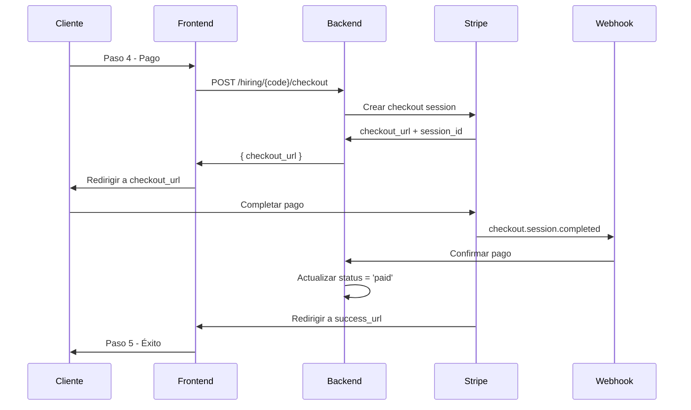

# 🛒 Backend: Implementación Completa Stripe Checkout

## 🎯 Endpoint Principal

### **POST `/api/hiring/{hiring_code}/checkout`**

Crea una sesión de Stripe Checkout para procesar el pago del servicio de contratación.

---

## 🔧 Implementación Backend Completa

### **1. Dependencias Requeridas**

```python
# requirements.txt
stripe>=7.0.0
fastapi>=0.104.0
```

### **2. Configuración de Stripe**

```python
import stripe
import os
from fastapi import FastAPI, HTTPException, Depends
from pydantic import BaseModel
from typing import Optional

# Configurar Stripe
stripe.api_key = os.getenv("STRIPE_SECRET_KEY")  # sk_live_... o sk_test_...

class CheckoutResponse(BaseModel):
    checkout_url: str
    session_id: str
```

### **3. Endpoint Principal**

```python
@app.post("/api/hiring/{hiring_code}/checkout", response_model=CheckoutResponse)
async def create_checkout_session(hiring_code: str):
    """Crear sesión de Stripe Checkout para el código de contratación"""
    
    try:
        # 1. Obtener datos del hiring desde la base de datos
        hiring = await get_hiring_by_code(hiring_code)
        if not hiring:
            raise HTTPException(status_code=404, detail="Código de contratación no encontrado")
        
        # 2. Verificar que el código no haya expirado
        if hiring.expires_at < datetime.utcnow():
            raise HTTPException(status_code=400, detail="El código de contratación ha expirado")
        
        # 3. Verificar que no esté ya pagado
        if hiring.status == "paid":
            raise HTTPException(status_code=400, detail="Este código ya ha sido pagado")
        
        # 4. Crear sesión de Stripe Checkout
        checkout_session = stripe.checkout.Session.create(
            payment_method_types=['card'],
            line_items=[{
                'price_data': {
                    'currency': 'eur',
                    'product_data': {
                        'name': hiring.service_name,
                        'description': f'Servicio de contratación - Código: {hiring_code}',
                    },
                    'unit_amount': hiring.amount,  # En centavos (ej: 40000 = 400€)
                },
                'quantity': 1,
            }],
            mode='payment',
            success_url=f'https://contratacion.migro.es/contratacion/{hiring_code}?step=5&payment=success&session_id={{CHECKOUT_SESSION_ID}}',
            cancel_url=f'https://contratacion.migro.es/contratacion/{hiring_code}?step=4&payment=cancelled',
            customer_email=hiring.user_email,
            metadata={
                'hiring_code': hiring_code,
                'user_email': hiring.user_email,
                'user_name': hiring.user_name,
                'service_name': hiring.service_name,
                'amount': str(hiring.amount),
            },
            # Configuraciones adicionales
            billing_address_collection='required',
            shipping_address_collection={
                'allowed_countries': ['ES'],  # Solo España
            },
            # Configurar webhook para confirmar el pago
            payment_intent_data={
                'metadata': {
                    'hiring_code': hiring_code,
                    'user_email': hiring.user_email,
                }
            }
        )
        
        # 5. Guardar session_id en la base de datos para tracking
        await update_hiring_checkout_session(hiring_code, checkout_session.id)
        
        logger.info(f"Checkout session creada para {hiring_code}: {checkout_session.id}")
        
        return CheckoutResponse(
            checkout_url=checkout_session.url,
            session_id=checkout_session.id
        )
        
    except stripe.error.StripeError as e:
        logger.error(f"Error de Stripe para {hiring_code}: {str(e)}")
        raise HTTPException(status_code=400, detail=f"Error de procesamiento de pago: {str(e)}")
    
    except HTTPException:
        raise
    
    except Exception as e:
        logger.error(f"Error interno creando checkout para {hiring_code}: {str(e)}")
        raise HTTPException(status_code=500, detail="Error interno del servidor")
```

### **4. Funciones de Base de Datos**

```python
async def get_hiring_by_code(hiring_code: str):
    """Obtener datos del hiring por código"""
    # Implementar según tu ORM (SQLAlchemy, Tortoise, etc.)
    hiring = await db.query(Hiring).filter(Hiring.hiring_code == hiring_code).first()
    return hiring

async def update_hiring_checkout_session(hiring_code: str, session_id: str):
    """Actualizar hiring con session_id de checkout"""
    await db.query(Hiring).filter(Hiring.hiring_code == hiring_code).update({
        'checkout_session_id': session_id,
        'updated_at': datetime.utcnow()
    })
    await db.commit()
```

---

## 🔔 Webhook para Confirmar Pagos

### **Endpoint Webhook**

```python
@app.post("/api/webhooks/stripe")
async def stripe_webhook(request: Request):
    """Webhook de Stripe para confirmar pagos"""
    
    payload = await request.body()
    sig_header = request.headers.get('stripe-signature')
    
    try:
        # Verificar webhook signature
        event = stripe.Webhook.construct_event(
            payload, sig_header, os.getenv("STRIPE_WEBHOOK_SECRET")
        )
    except ValueError:
        raise HTTPException(status_code=400, detail="Invalid payload")
    except stripe.error.SignatureVerificationError:
        raise HTTPException(status_code=400, detail="Invalid signature")
    
    # Manejar evento de pago exitoso
    if event['type'] == 'checkout.session.completed':
        session = event['data']['object']
        hiring_code = session['metadata']['hiring_code']
        
        # Confirmar pago en la base de datos
        await confirm_payment(hiring_code, session['id'])
        
        logger.info(f"Pago confirmado para {hiring_code} via webhook")
    
    elif event['type'] == 'payment_intent.succeeded':
        payment_intent = event['data']['object']
        hiring_code = payment_intent['metadata']['hiring_code']
        
        # Confirmar pago en la base de datos
        await confirm_payment(hiring_code, payment_intent['id'])
        
        logger.info(f"Pago confirmado para {hiring_code} via payment_intent")
    
    return {"status": "success"}

async def confirm_payment(hiring_code: str, stripe_payment_id: str):
    """Confirmar pago en la base de datos"""
    await db.query(Hiring).filter(Hiring.hiring_code == hiring_code).update({
        'status': 'paid',
        'payment_confirmed': True,
        'payment_confirmed_at': datetime.utcnow(),
        'stripe_payment_id': stripe_payment_id,
        'updated_at': datetime.utcnow()
    })
    await db.commit()
```

---

## 🧪 Testing Completo

### **1. Crear Checkout Session**

```bash
curl -X POST "https://api.migro.es/api/hiring/LIVE1/checkout" \
  -H "Content-Type: application/json" \
  -d '{}'
```

**Response esperada:**
```json
{
  "checkout_url": "https://checkout.stripe.com/pay/cs_live_123456789",
  "session_id": "cs_live_123456789"
}
```

### **2. Probar Checkout**

1. **Abrir checkout_url** en el navegador
2. **Usar tarjeta de prueba:** `4242 4242 4242 4242`
3. **Completar pago**
4. **Verificar redirección** a success URL

### **3. Verificar Webhook**

```bash
# Simular webhook (usando Stripe CLI)
stripe listen --forward-to https://api.migro.es/api/webhooks/stripe
```

---

## 🔧 Configuración de Variables de Entorno

### **Backend (.env)**

```bash
# Stripe
STRIPE_SECRET_KEY=sk_live_51...
STRIPE_PUBLISHABLE_KEY=pk_live_51...
STRIPE_WEBHOOK_SECRET=whsec_...

# Base de datos
DATABASE_URL=postgresql://...

# URLs
FRONTEND_URL=https://contratacion.migro.es
API_URL=https://api.migro.es
```

---

## 📋 Checklist de Implementación

### **Backend:**
- [ ] Instalar dependencia `stripe>=7.0.0`
- [ ] Configurar `STRIPE_SECRET_KEY` en variables de entorno
- [ ] Implementar endpoint `POST /api/hiring/{code}/checkout`
- [ ] Implementar webhook `POST /api/webhooks/stripe`
- [ ] Configurar `STRIPE_WEBHOOK_SECRET`
- [ ] Probar con código LIVE1

### **Stripe Dashboard:**
- [ ] Configurar webhook endpoint en Stripe Dashboard
- [ ] Seleccionar eventos: `checkout.session.completed`, `payment_intent.succeeded`
- [ ] Copiar webhook secret a variables de entorno

### **Frontend:**
- [x] ✅ Ya implementado - PaymentForm con Stripe Checkout
- [x] ✅ Ya implementado - Redirección a checkout_url
- [x] ✅ Ya implementado - Manejo de códigos TEST

---

## 🚀 Flujo Completo



---

## ⚠️ Consideraciones Importantes

### **Seguridad:**
- ✅ **Webhook signature verification** - Obligatorio
- ✅ **HTTPS only** - Stripe requiere HTTPS
- ✅ **Validar metadata** - Verificar hiring_code en webhook

### **Error Handling:**
- ✅ **Código expirado** - Verificar expires_at
- ✅ **Ya pagado** - Verificar status
- ✅ **Stripe errors** - Manejar errores de Stripe
- ✅ **Webhook failures** - Logging y retry

### **Testing:**
- ✅ **Códigos TEST** - Funcionan sin Stripe
- ✅ **Códigos LIVE** - Requieren implementación completa
- ✅ **Webhook testing** - Usar Stripe CLI

---

**Estado:** ⚠️ **Implementación backend requerida**  
**Prioridad:** 🔥 **ALTA** - Necesario para códigos LIVE  
**Última actualización:** 15 de Enero de 2024
