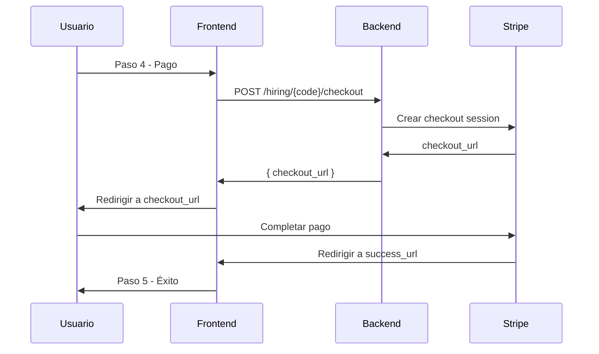

# 🎯 Resumen Ejecutivo: Implementación Backend Stripe Checkout

## ✅ **Frontend COMPLETADO**

- ✅ **PaymentForm.tsx:** Implementado con Stripe Checkout
- ✅ **hiringService.ts:** Método `createCheckoutSession()` agregado
- ✅ **TypeScript:** Errores corregidos
- ✅ **Deploy:** Funcionando en producción

---

## ⚠️ **Backend REQUERIDO**

### **Endpoint Principal:**
```
POST /api/hiring/{hiring_code}/checkout
```

### **Implementación Mínima:**

```python
@app.post("/api/hiring/{hiring_code}/checkout")
async def create_checkout_session(hiring_code: str):
    """Crear sesión de Stripe Checkout"""
    
    # 1. Obtener datos del hiring
    hiring = await get_hiring_by_code(hiring_code)
    if not hiring:
        raise HTTPException(status_code=404, detail="Código no encontrado")
    
    # 2. Crear sesión de Stripe Checkout
    checkout_session = stripe.checkout.Session.create(
        payment_method_types=['card'],
        line_items=[{
            'price_data': {
                'currency': 'eur',
                'product_data': {
                    'name': hiring.service_name,
                },
                'unit_amount': hiring.amount,  # En centavos
            },
            'quantity': 1,
        }],
        mode='payment',
        success_url=f'https://contratacion.migro.es/contratacion/{hiring_code}?step=5&payment=success&session_id={{CHECKOUT_SESSION_ID}}',
        cancel_url=f'https://contratacion.migro.es/contratacion/{hiring_code}?step=4&payment=cancelled',
        customer_email=hiring.user_email,
        metadata={
            'hiring_code': hiring_code,
            'user_email': hiring.user_email,
        }
    )
    
    return {
        "checkout_url": checkout_session.url,
        "session_id": checkout_session.id
    }
```

---

## 🔧 **Variables de Entorno Requeridas**

```bash
# Backend (.env)
STRIPE_SECRET_KEY=sk_live_51...  # Tu clave secreta de Stripe
```

---

## 🧪 **Testing Inmediato**

### **1. Códigos TEST (Ya funcionan):**
```bash
curl -X POST "https://api.migro.es/api/hiring/TEST1/checkout" \
  -H "Content-Type: application/json" \
  -d '{}'
```

### **2. Códigos LIVE (Requieren implementación):**
```bash
curl -X POST "https://api.migro.es/api/hiring/LIVE1/checkout" \
  -H "Content-Type: application/json" \
  -d '{}'
```

---

## 🚀 **Flujo Completo**



---

## 📋 **Checklist de Implementación**

### **Backend:**
- [ ] Instalar `stripe>=7.0.0`
- [ ] Configurar `STRIPE_SECRET_KEY`
- [ ] Implementar endpoint `POST /api/hiring/{code}/checkout`
- [ ] Probar con código LIVE1

### **Stripe Dashboard:**
- [ ] Verificar que tienes cuenta Stripe activa
- [ ] Copiar `STRIPE_SECRET_KEY` de Stripe Dashboard
- [ ] Configurar webhook (opcional para MVP)

---

## ⚡ **Implementación Rápida (15 minutos)**

### **1. Instalar Stripe:**
```bash
pip install stripe>=7.0.0
```

### **2. Configurar variable:**
```bash
export STRIPE_SECRET_KEY="sk_live_51..."
```

### **3. Implementar endpoint:**
```python
import stripe

stripe.api_key = os.getenv("STRIPE_SECRET_KEY")

@app.post("/api/hiring/{hiring_code}/checkout")
async def create_checkout_session(hiring_code: str):
    # Código del endpoint (ver arriba)
    pass
```

### **4. Probar:**
```bash
curl -X POST "https://api.migro.es/api/hiring/LIVE1/checkout" \
  -H "Content-Type: application/json" \
  -d '{}'
```

---

## 🎯 **Estado Actual**

| Componente | Estado | Notas |
|------------|--------|-------|
| **Frontend** | ✅ COMPLETO | Stripe Checkout implementado |
| **Backend Endpoint** | ⚠️ PENDIENTE | Requiere implementación |
| **Códigos TEST** | ✅ FUNCIONAN | Simulación sin Stripe |
| **Códigos LIVE** | ⚠️ PENDIENTE | Requieren endpoint backend |
| **CORS** | ⚠️ PENDIENTE | Requiere configuración |

---

## 🚀 **Próximo Paso**

**Implementar el endpoint `/api/hiring/{code}/checkout` en el backend.**

Una vez implementado:
1. ✅ Códigos LIVE funcionarán con Stripe real
2. ✅ Pagos de 1 EUR se procesarán correctamente
3. ✅ Redirección automática a success/cancel URLs
4. ✅ Flujo completo funcional

---

**Prioridad:** 🔥 **ALTA** - Bloquea funcionalidad de códigos LIVE  
**Tiempo estimado:** 15-30 minutos  
**Dependencias:** Solo Stripe SDK y clave secreta
